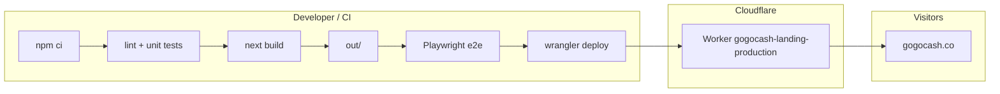

# GoGoCash — Marketing landing (Next.js)

Production marketing site for **GoGoCash**, built as a **static export** from **Next.js 16** and served from **Cloudflare Workers** (static assets on worker `gogocash-landing-production`, custom domains `gogocash.co` and `www.gogocash.co`). The stack emphasizes fast static delivery, localized landing paths, optional partner data at build time, and pluggable marketing analytics (Firebase Analytics, LINE Tag).

**Canonical source repository:** [github.com/mygogocash/landing-page](https://github.com/mygogocash/landing-page)

This document is the **canonical onboarding guide** for the repo. Topic-specific runbooks live under [`docs/`](./docs/).

---

## Table of contents

1. [Architecture](#architecture)
2. [Repository layout](#repository-layout)
3. [Prerequisites](#prerequisites)
4. [Quick start](#quick-start)
5. [Environment variables](#environment-variables)
6. [npm scripts](#npm-scripts)
7. [Local development](#local-development)
8. [Production build](#production-build)
9. [Cloudflare Workers (production hosting)](#cloudflare-workers-production-hosting)
10. [Firebase Hosting (legacy / staging)](#firebase-hosting-legacy--staging)
11. [Cloudflare DNS](#cloudflare-dns)
12. [CI/CD (GitHub Actions)](#cicd-github-actions)
13. [Testing](#testing)
14. [Linting & typecheck](#linting--typecheck)
15. [Patches & tooling notes](#patches--tooling-notes)
16. [Further reading](#further-reading)
17. [Troubleshooting](#troubleshooting)
18. [Social preview (Open Graph)](#social-preview-open-graph)

---

## Architecture

| Layer | Choice | Notes |
|--------|--------|--------|
| Framework | Next.js 16 (App Router) | `output: "export"` → static HTML in `out/` |
| Styling | Tailwind CSS 4 | `tailwind.config.ts` plus the `@tailwindcss/postcss` adapter in [`postcss.config.mjs`](./postcss.config.mjs) |
| Motion | Framer Motion | Tree-shaken via `experimental.optimizePackageImports` in [`next.config.mjs`](./next.config.mjs) |
| Content | React 19, `react-markdown` | Learn hub and legal pages |
| SEO / link previews | Next.js `metadata` + shared constants | Default title, description, `og:image`, and Twitter cards; see [Social preview](#social-preview-open-graph) |
| Hosting | Cloudflare Workers (static assets) | Worker `gogocash-landing-production`; config in [`wrangler.production.jsonc`](./wrangler.production.jsonc); serves `out/` |
| Server/API in prod | None for this export | Static files only at the edge unless you add a separate backend |
| E2E | Playwright | Serves `out/` with `serve` when `CI=true` — see [`playwright.config.ts`](./playwright.config.ts) |

High-level deploy path:



**Important:** This app is **not** a Node server in production. There is no `next start` on the live site; visitors receive **static files** from the Cloudflare Worker assets binding.

---

## Repository layout

| Path | Purpose |
|------|---------|
| [`app/`](./app/) | App Router routes: home, locale roots (`/en`, `/th`, `/id`, `/ja`, `/tw`), learn hub, search, legal, about, etc. |
| [`components/`](./components/) | Shared UI: header, footer, landing sections, analytics wrappers, locale menu, legal shell |
| [`lib/`](./lib/) | Config (`app-config.ts`), SEO helpers ([`social-preview.ts`](./lib/social-preview.ts) for OG/Twitter defaults), analytics helpers, routing utilities, tests colocated as `*.test.ts` |
| [`public/`](./public/) | Static assets (images, icons) copied into `out/` |
| [`e2e/`](./e2e/) | Playwright specs |
| [`scripts/`](./scripts/) | Deploy helpers, Cloudflare DNS, dev helpers, optional Strapi push |
| [`wrangler.production.jsonc`](./wrangler.production.jsonc) | Cloudflare Worker config for production static deploy (`out/`) |
| [`docs/`](./docs/) | Deploy, migration from Framer, learn content, etc. |
| [`.github/workflows/`](./.github/workflows/) | Build/test workflows; production ships via Cloudflare (see [CI/CD](#cicd-github-actions)) |

---

## Prerequisites

- **Node.js 22.x** (use [`.nvmrc`](./.nvmrc) / `fnm` / `nvm`; `package.json` `engines` is `>=22 <23`).
- **npm** (lockfile is `package-lock.json`; use `npm ci` in CI and for reproducible installs).
- For **production deploy to Cloudflare**: [Wrangler](https://developers.cloudflare.com/workers/wrangler/) (`npx wrangler`) and access to the GoGoCash Cloudflare account. Run `npx wrangler login` once locally, or set `CLOUDFLARE_API_TOKEN` in CI.
- For **legacy Firebase deploy** (staging/beta sites): Firebase CLI is a **devDependency** — prefer `npm exec -- firebase` from the repo root.
- For **Cloudflare DNS scripts**: `curl`, `jq`, and a Cloudflare API token (see [Cloudflare DNS](#cloudflare-dns)).
- For **Playwright locally**: after `npm ci`, run `npm run test:e2e:install` once to download browsers. On **Linux**, WebKit also needs system libraries—use `npx playwright install --with-deps chromium webkit` if launches fail with missing `.so` files.

---

## Quick start

```bash
git clone https://github.com/mygogocash/landing-page.git
cd landing-page
npm ci
cp .env.example .env.local   # optional; see Environment variables
npm run dev
```

Open `http://127.0.0.1:3000` (dev server binds `0.0.0.0:3000`).

---

## Environment variables

Variables are documented inline in **[`.env.example`](./.env.example)**. Below is a consolidated reference.

### Build-time / runtime (Next.js)

| Variable | Required | Purpose |
|----------|----------|---------|
| `NEXT_PUBLIC_SITE_URL` | Recommended for prod builds | Canonical public URL (metadata, OG, sitemap). Falls back to `VERCEL_URL` or defaults in code. |
| `INVOLVE_ASIA_API_KEY` / `INVOLVE_ASIA_API_SECRET` | Optional | If set, build can pull live partner/offer data; otherwise bundled/static behavior is used. |
| `INVOLVE_ASIA_MAX_OFFER_PAGES` | Optional | Caps Involve Asia pagination during build. |
| `NEXT_PUBLIC_FIREBASE_*` | Optional | Override public Firebase web config (defaults live in [`lib/app-config.ts`](./lib/app-config.ts)). |
| `NEXT_PUBLIC_ANALYTICS_ENABLED` | Optional | `true` / `false` — gates marketing analytics defaults. |
| `NEXT_PUBLIC_LINE_TAG_ID` | Optional | Empty string disables LINE Tag; must look like a UUID when set. |
| `NEXT_PUBLIC_LINE_TAG_ENABLED` | Optional | Force LINE Tag on/off when an id exists. |
| `NEXT_PUBLIC_CUSTOMERIO_FORMS_SITE_ID` / `NEXT_PUBLIC_CUSTOMERIO_FORMS_BASE_URL` | Optional | Customer.io Connected Forms config for the footer newsletter form. Defaults to the GoGoCash Customer.io Forms snippet; empty site id disables it. |
| `NEXT_PUBLIC_NEWSLETTER_FORM_ACTION` | Optional | Hosted footer newsletter form endpoint from Mailchimp, Brevo, Customer.io, etc. Visitors can enter an email and click Subscribe after consent; provider-backed submission shows a setup notice until this is configured. |
| `NEXT_PUBLIC_NEWSLETTER_EMAIL_FIELD` / `NEXT_PUBLIC_NEWSLETTER_CONSENT_FIELD` | Optional | Provider-specific field names for the footer newsletter email and PDPA consent checkbox. Defaults to `email` and `pdpa_consent`. |
| `NEXT_PUBLIC_NEWSLETTER_SOURCE_FIELD` / `NEXT_PUBLIC_NEWSLETTER_SOURCE_VALUE` | Optional | Provider-specific source tracking field/value for the footer newsletter form. Defaults to `source=footer`. |
| `STRAPI_URL` | Optional | If set at build time, Learn hub/articles may load from Strapi; otherwise local Markdown. See [`docs/learn-content.md`](./docs/learn-content.md). |
| `STRAPI_API_TOKEN` | Optional | Strapi API token for protected content types (build-time only). |

**Critical:** `NEXT_PUBLIC_*` values are **inlined at `next build`**. Changing them requires a **rebuild** and **redeploy**. For GitHub Actions, set repository secrets and pass them into the build step as in [`.github/workflows/build-landing.yml`](./.github/workflows/build-landing.yml).

### Local-only files (never commit secrets)

| File | Purpose |
|------|---------|
| `.env.local` | Local Next.js overrides (gitignored by default pattern). |
| `.env.production.local` | Production-like local builds without committing keys. |
| `.env.cloudflare` | `CLOUDFLARE_API_TOKEN`, `CLOUDFLARE_ZONE_ID`, optional `CLOUDFLARE_ACCOUNT_ID` for DNS automation and Wrangler (gitignored). Template: [`.env.cloudflare.example`](./.env.cloudflare.example). |

---

## npm scripts

| Script | What it does |
|--------|----------------|
| `npm run dev` | Next dev server (Turbopack), port 3000. |
| `npm run build` | Static export → `out/`. |
| `npm run build:webpack` | Same as `build` but **Webpack** (used by `analyze`; default build uses Turbopack). |
| `npm run analyze` | Webpack build with `@next/bundle-analyzer` (`ANALYZE=true`); writes HTML under `.next/analyze/` (e.g. `client.html`; `.next/` is gitignored). |
| `npm run analyze:turbopack` | `next experimental-analyze` — interactive Turbopack bundle UI (no `out/` artifact). |
| `npm run start` | `next start` — **not** used for production (static Worker hosting only). |
| `npm run lint` | ESLint (flat config in [`eslint.config.mjs`](./eslint.config.mjs)). |
| `npm run test` | Node test runner via `tsx` on `lib/**/*.test.ts`. |
| `npm run typecheck` | `tsc --noEmit`. |
| `npm run verify` | `lint` + `test` + `typecheck` + `build`. |
| `npm run test:e2e` | Playwright (local: tries dev server with reuse). |
| `npm run test:e2e:ci` | Playwright with `CI=true` behavior from config (serves `out/`). |
| `npm run test:e2e:install` | Install Chromium + WebKit for Playwright. |
| `npm run deploy:cloudflare` | `build` + `wrangler deploy --config wrangler.production.jsonc` (production Worker). |
| `npm run deploy:firebase` | `build` + [`scripts/deploy-firebase-hosting.mjs`](./scripts/deploy-firebase-hosting.mjs) — **legacy** staging/beta Firebase sites only. |
| `npm run deploy:firebase:full` | Alias for `deploy:firebase`. |
| `npm run dns:cloudflare-firebase-apex` | Load `.env.cloudflare` and run legacy Firebase apex DNS helper (historical migration). |
| `npm run learn:strapi-push` | Push local learn Markdown to Strapi (see [`docs/learn-content.md`](./docs/learn-content.md)). |
| `npm run lh:mobile` | Lighthouse mobile preset against `http://127.0.0.1:3000/` (requires dev server + `npx` download). |

---

## Local development

- **Standard:** `npm run dev`.
- **Alternative:** `npm run dev:local` runs [`scripts/dev-local.sh`](./scripts/dev-local.sh) if you keep machine-specific steps there.
- **Webpack dev:** `npm run dev:webpack` if you need to compare Turbopack vs Webpack behavior.

Hot reload and HMR work against the dev server; **always validate production output** with `npm run build` because the live site is static export, not SSR.

---

## Production build

```bash
npm run build
```

Artifacts land in **`out/`**. [`next.config.mjs`](./next.config.mjs) sets `output: "export"` and `images.unoptimized: true` (required for static export with remote images as configured).

**Bundle size:** run `npm run analyze` (Webpack report under `.next/analyze/`) or `npm run analyze:turbopack` for the Turbopack UI. Production CI uses the default Turbopack build, not the Webpack analyzer path.

Preview static output locally (similar to CI):

```bash
npx --yes serve@14 out -l 3000
```

---

## Cloudflare Workers (production hosting)

Production traffic for **`gogocash.co`** and **`www.gogocash.co`** is served by the Cloudflare Worker **`gogocash-landing-production`**, which publishes the static export in **`out/`** via the assets binding in [`wrangler.production.jsonc`](./wrangler.production.jsonc).

| Item | Value |
|------|--------|
| Worker name | `gogocash-landing-production` |
| Wrangler config | [`wrangler.production.jsonc`](./wrangler.production.jsonc) |
| Cloudflare account | GoGoCash (`187ab61ed9dbc6e616cb23e6b95aa8f1`) |
| Deployed static root | `out/` (from `npm run build`) |
| Custom domains | `gogocash.co`, `www.gogocash.co` (Worker custom domains on the zone) |

**Deploy production (build + upload):**

```bash
npm run deploy:cloudflare
```

Equivalent manual steps:

```bash
npm run build
npx wrangler deploy --config wrangler.production.jsonc
```

Authenticate once with `npx wrangler login`, or set `CLOUDFLARE_API_TOKEN` (Workers Scripts write + account read). The GoGoCash account id is pinned in [`wrangler.production.jsonc`](./wrangler.production.jsonc); set `CLOUDFLARE_ACCOUNT_ID` only if you use a different config without `account_id`.

Production builds emit **canonical asset URLs** (`https://gogocash.co/...`) via [`lib/public-asset-url.ts`](./lib/public-asset-url.ts) so images and icons still load when the hostname has a trailing dot (`gogocash.co.`).

Related Cloudflare pieces (separate from the landing deploy):

- [`infra/posthog-proxy/`](./infra/posthog-proxy/) — optional PostHog reverse proxy Worker on `gogocash.co/ingest/*` (see [`docs/posthog-reverse-proxy.md`](./docs/posthog-reverse-proxy.md)).
- [`.github/workflows/deploy-cms-cloudflare.yml`](./.github/workflows/deploy-cms-cloudflare.yml) — Learn CMS (Strapi) container deploy.

---

## Firebase Hosting (legacy / staging)

[`firebase.json`](./firebase.json) and [`scripts/deploy-firebase-hosting.mjs`](./scripts/deploy-firebase-hosting.mjs) remain for **non-production** Firebase Hosting sites (e.g. staging `gogocash-landing-staging`, beta). **Do not use this path for `gogocash.co`** — production is on Cloudflare Workers (above).

| Item | Value |
|------|--------|
| GCP / Firebase project | `landing-page-4ae23` ([`.firebaserc`](./.firebaserc)) |
| Default hosting site id in repo | `landing-page-4ae23` ([`firebase.json`](./firebase.json)) |

```bash
npm run deploy:firebase
```

Operational detail: **[`docs/firebase-deploy.md`](./docs/firebase-deploy.md)**.

---

## Cloudflare DNS

The **`gogocash.co`** zone is managed in Cloudflare. Production landing hostnames (`gogocash.co`, `www.gogocash.co`) are attached to the **`gogocash-landing-production`** Worker as custom domains in the Cloudflare dashboard — not via Firebase apex `A` records.

Legacy scripts from the Framer → Next → Firebase migration still exist if you need to adjust old apex records:

- [`scripts/cloudflare-firebase-dns-setup.sh`](./scripts/cloudflare-firebase-dns-setup.sh)
- [`scripts/run-cloudflare-firebase-dns.sh`](./scripts/run-cloudflare-firebase-dns.sh)

```bash
cp .env.cloudflare.example .env.cloudflare
# edit .env.cloudflare — token needs Zone → DNS → Edit for gogocash.co

npm run dns:cloudflare-firebase-apex
# optional: DRY_RUN=1 npm run dns:cloudflare-firebase-apex
```

---

## CI/CD (GitHub Actions)

| Workflow | Branch | Deploy target |
|----------|--------|---------------|
| **[`build-landing.yml`](./.github/workflows/build-landing.yml)** | `production` | Build + test + e2e; **Firebase deploy step is legacy** (production site is on Cloudflare — use `npm run deploy:cloudflare` or add a Cloudflare deploy step) |
| **[`deploy-staging.yml`](./.github/workflows/deploy-staging.yml)** | `staging` | Firebase Hosting site `gogocash-landing-staging` |
| **[`deploy-beta.yml`](./.github/workflows/deploy-beta.yml)** | `beta` | Firebase Hosting site `gogocash-landing-beta` (scaffold) |
| **[`deploy-cms-cloudflare.yml`](./.github/workflows/deploy-cms-cloudflare.yml)** | manual | Learn CMS on Cloudflare |

**Recommended production release today:**

1. Merge to `production` (or build from a clean checkout).
2. Run `npm run verify` locally or rely on CI build/test/e2e steps.
3. Deploy: `npm run deploy:cloudflare` with Wrangler auth (see [Cloudflare Workers](#cloudflare-workers-production-hosting)).

**GitHub repository secrets (optional but recommended for partner data):**

- `INVOLVE_ASIA_API_KEY`
- `INVOLVE_ASIA_API_SECRET`

**Cloudflare (production deploy):** set repository variable `CLOUDFLARE_ACCOUNT_ID` and secret `CLOUDFLARE_API_TOKEN` if you wire Wrangler into CI. The GoGoCash account id is `187ab61ed9dbc6e616cb23e6b95aa8f1`.

**Google Cloud (Firebase staging/beta only):** staging/beta workflows use **Workload Identity Federation**. Pool / provider / service account IDs are in workflow YAML and repo variables (`FIREBASE_WIF_PROVIDER`, `FIREBASE_SA_EMAIL`).

---

## Testing

| Layer | Command | Scope |
|--------|---------|--------|
| Unit / integration (light) | `npm run test` | `lib/**/*.test.ts` (e.g. `app-config`, routing helpers, Strapi/Involve fallbacks) |
| E2E | `npm run test:e2e` or `npm run test:e2e:ci` | Smoke, navigation, sitemap, mobile overflow, landmarks — see [`e2e/`](./e2e/) |
| Full gate | `npm run verify` | Lint + unit + typecheck + build |

Playwright projects: **mobile-chrome** (Pixel 5) and **mobile-safari** (iPhone 12), see [`playwright.config.ts`](./playwright.config.ts).

---

## Linting & typecheck

- **ESLint 9** with [`eslint.config.mjs`](./eslint.config.mjs) extending `eslint-config-next` (Core Web Vitals + TypeScript).
- **Ignored paths** in config: `e2e/`, `out/`, etc. Do not remove `node_modules` / `.next` ignore flags from the `lint` script without cause.
- Avoid forcing incompatible **npm overrides** on transitive deps used by ESLint (historically `brace-expansion@5` broke `minimatch` inside `@eslint/config-array`).

---

## Patches & tooling notes

- **Tailwind CSS 4**: Global styles import Tailwind from [`app/globals.css`](./app/globals.css) and load the project config with `@config "../tailwind.config.ts"`. PostCSS uses `@tailwindcss/postcss`; no `patch-package` patch is currently required.
- **Firebase CLI**: Use the **project-local** version (`npm exec -- firebase`) for legacy Firebase Hosting deploys only.
- **Wrangler**: Use `npx wrangler` from the repo root for production; config is pinned in [`wrangler.production.jsonc`](./wrangler.production.jsonc) and tested in [`lib/cloudflare-build-contract.test.ts`](./lib/cloudflare-build-contract.test.ts).

---

## Further reading

| Document | Topic |
|----------|--------|
| [`docs/firebase-deploy.md`](./docs/firebase-deploy.md) | Legacy Firebase Hosting deploy (staging/beta) |
| [`docs/posthog-reverse-proxy.md`](./docs/posthog-reverse-proxy.md) | Optional PostHog proxy Worker on Cloudflare |
| [`docs/framer-to-next-migration.md`](./docs/framer-to-next-migration.md) | Migration notes from Framer |
| [`docs/learn-content.md`](./docs/learn-content.md) | Learn articles: local files vs Strapi, CI, `learn:strapi-push` |

---

## Troubleshooting

| Symptom | Things to check |
|---------|------------------|
| Broken logos / 403 on static assets | Production uses canonical URLs from [`lib/public-asset-url.ts`](./lib/public-asset-url.ts). Rebuild and run `npm run deploy:cloudflare`. Trailing-dot hostnames (`gogocash.co.`) should redirect or load assets from `https://gogocash.co/...`. |
| Wrangler: “unable to select account” | Ensure [`wrangler.production.jsonc`](./wrangler.production.jsonc) includes `account_id`, or set `CLOUDFLARE_ACCOUNT_ID`. |
| Firebase domain verification / SSL **526** (legacy) | Only relevant for Firebase-hosted sites. Apex `A` must be **DNS only** (grey cloud) to `199.36.158.100`. See `npm run dns:cloudflare-firebase-apex`. |
| `npm run lint` crashes with `expand is not a function` | Broken `minimatch` / `brace-expansion` mix — remove incompatible `overrides` in `package.json` and run `npm install`. |
| Build works locally, CI fails | Compare Node version (22.x), ensure `npm ci` lockfile is committed, check GitHub Actions logs for the failing step. |
| Firebase deploy auth errors in CI | Staging/beta WIF only. Production landing deploy is Cloudflare Wrangler, not Firebase. |
| Empty partner data in build | Set `INVOLVE_ASIA_*` for build, or accept static fallback documented in `.env.example`. |
| E2E WebKit: “Host system is missing dependencies” (CI/Linux) | Run `npx playwright install --with-deps chromium webkit` (see workflow); `playwright install` alone is not enough for WebKit on Ubuntu. |

---

## Social preview (Open Graph)

Default **link preview** copy (title, description, image) for the marketing site is centralized in **[`lib/social-preview.ts`](./lib/social-preview.ts)** and consumed from [`app/layout.tsx`](./app/layout.tsx) (root metadata), [`app/en/page.tsx`](./app/en/page.tsx), and as the fallback image for learn articles in [`app/learn/[slug]/page.tsx`](./app/learn/[slug]/page.tsx).

| Item | Location |
|------|----------|
| OG / Twitter image | [`public/images/gogocash-social-preview.jpg`](./public/images/gogocash-social-preview.jpg) (referenced by `OG_IMAGE_*` in `social-preview.ts`) |
| Title & description strings | Exported as `SOCIAL_PREVIEW_TITLE` and `SOCIAL_PREVIEW_DESCRIPTION` |

[`scripts/generate-seo-assets.mjs`](./scripts/generate-seo-assets.mjs) generates logo and LINE QR assets only; it does **not** overwrite the hand-maintained social preview image.

After changing copy or the image, rebuild and redeploy. Social platforms cache previews—use each platform’s debugger (e.g. Facebook Sharing Debugger) to refresh cached `og:image` when needed.

---

## License

Proprietary — **GoGoCash**. Do not deploy to unauthorized Cloudflare accounts, Firebase projects, or domains without explicit approval.
