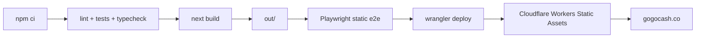

# GoGoCash — Marketing landing (Next.js)

Production marketing site for **GoGoCash**, built as a **static export** from
**Next.js 16** and deployed to **Cloudflare Workers Static Assets**.

**Canonical source repository:** [github.com/mygogocash/gogocash-landing-page](https://github.com/mygogocash/gogocash-landing-page)

## Architecture

| Layer | Choice | Notes |
|-------|--------|-------|
| Framework | Next.js 16 App Router | `output: "export"` writes static HTML to `out/` |
| Hosting | Cloudflare Workers Static Assets | Wrangler configs: `wrangler.*.jsonc` |
| Styling | Tailwind CSS 4 | `@tailwindcss/postcss` via `postcss.config.mjs` |
| Motion | Framer Motion | Tree-shaken via `experimental.optimizePackageImports` |
| Analytics | PostHog, Cloudflare Web Analytics, LINE Tag | Optional and cookie-consent gated |
| Content | Local Learn data, optional Strapi at build time | See `docs/learn-content.md` |
| E2E | Playwright | Can test dev server or exported `out/` |



This app is not a Node server in production. `next start` is not part of the
Cloudflare deployment path.

## Repository Layout

| Path | Purpose |
|------|---------|
| `app/` | App Router pages: home, locales, Learn, search, legal, about |
| `components/` | Shared UI, consent, analytics initializers, header/footer |
| `lib/` | Config, analytics helpers, routing utilities, tests |
| `public/` | Static assets copied into `out/`, including `_headers` |
| `e2e/` | Playwright specs |
| `.github/workflows/` | Production, staging, and beta Cloudflare deploy workflows |
| `docs/` | Deployment and content runbooks |

## Prerequisites

- Node.js 26.3.1 (`.nvmrc`, `package.json` engines)
- npm with `package-lock.json`
- Playwright browsers for local E2E: `npm run test:e2e:install`
- Cloudflare API token for deploys; see `docs/cloudflare-workers-deploy.md`

## Quick Start

```bash
git clone https://github.com/mygogocash/gogocash-landing-page.git
cd landing-page
npm ci
cp .env.example .env.local   # optional
npm run dev
```

Open `http://127.0.0.1:3000`.

## Environment Variables

Variables are documented in `.env.example`. Important production variables:

| Variable | Required | Purpose |
|----------|----------|---------|
| `NEXT_PUBLIC_SITE_URL` | Recommended | Canonical URL for metadata and sitemap |
| `INVOLVE_ASIA_API_KEY` / `INVOLVE_ASIA_API_SECRET` | Optional | Build-time partner data |
| `NEXT_PUBLIC_ANALYTICS_ENABLED` | Optional | Force marketing analytics on/off |
| `NEXT_PUBLIC_CLOUDFLARE_WEB_ANALYTICS_TOKEN` | Optional | Cloudflare Web Analytics beacon token |
| `NEXT_PUBLIC_POSTHOG_KEY` | Optional | PostHog project key |
| `NEXT_PUBLIC_POSTHOG_HOST` / `NEXT_PUBLIC_POSTHOG_UI_HOST` | Optional | PostHog proxy/app hosts |
| `NEXT_PUBLIC_LINE_TAG_ID` / `NEXT_PUBLIC_LINE_TAG_ENABLED` | Optional | LINE Tag config |
| `NEXT_PUBLIC_CUSTOMERIO_FORMS_*` | Optional | Customer.io Connected Forms config |
| `NEXT_PUBLIC_NEWSLETTER_*` | Optional | Newsletter provider form field mapping |
| `STRAPI_URL` / `STRAPI_API_TOKEN` | Optional | Build-time Learn CMS |

Cloudflare deploy variables:

| Variable | Store | Purpose |
|----------|-------|---------|
| `CLOUDFLARE_API_TOKEN` | GitHub secret | Wrangler deploy auth |
| `CLOUDFLARE_ACCOUNT_ID` | GitHub variable | Cloudflare account target |
| `CLOUDFLARE_ZONE_ID` | Optional local env | Manual DNS/cutover checks |

`NEXT_PUBLIC_*` values are inlined at `next build`, so changes require rebuild
and redeploy.

## npm Scripts

| Script | What it does |
|--------|--------------|
| `npm run dev` | Next dev server on port 3000 |
| `npm run build` | Static export to `out/` |
| `npm run lint` | ESLint |
| `npm run test` | Node test runner for `lib/**/*.test.ts` |
| `npm run typecheck` | `tsc --noEmit` |
| `npm run verify` | lint + test + typecheck + build |
| `npm run test:e2e` | Playwright against dev server |
| `npm run test:e2e:static` | Build then Playwright against `out/` |
| `npm run deploy:cloudflare:production` | Build and deploy production Worker |
| `npm run deploy:cloudflare:staging` | Build and deploy staging Worker |
| `npm run deploy:cloudflare:beta` | Build and deploy beta Worker |
| `npm run deploy:cloudflare:dry-run` | Build and dry-run all Wrangler deploy configs |
| `npm run learn:strapi-push` | Push local Learn Markdown to Strapi |

## Cloudflare Workers Deploy

| Environment | Branch | Worker | URL |
|-------------|--------|--------|-----|
| Production | `production` | `gogocash-landing-production` | `https://gogocash.co` |
| Staging | `staging` | `gogocash-landing-staging` | `https://staging.gogocash.co` |
| Beta | `beta` | `gogocash-landing-beta` | `https://beta.gogocash.co` |

Wrangler serves `out/` with:

- `html_handling: "drop-trailing-slash"`
- `not_found_handling: "404-page"`
- immutable `/_next/static/*` cache headers from `public/_headers`

Host-level `www` to apex redirects are configured in Cloudflare Redirect Rules,
not in `_redirects`, because Workers Static Assets `_redirects` only matches
paths.

Full runbook: `docs/cloudflare-workers-deploy.md`.

## CI/CD

GitHub Actions workflows:

- `.github/workflows/build-landing.yml` deploys production on `production`
- `.github/workflows/deploy-staging.yml` deploys staging on `staging`
- `.github/workflows/deploy-beta.yml` deploys beta on `beta`

Each workflow installs dependencies, runs lint/tests/typecheck, builds `out/`,
runs Playwright against the static export, then deploys with Wrangler.

## Testing

| Layer | Command |
|-------|---------|
| Unit/integration | `npm run test` |
| Typecheck | `npm run typecheck` |
| Static build | `npm run build` |
| Static E2E | `npm run test:e2e:static` |
| Full local gate | `npm run verify` |

## Troubleshooting

| Symptom | Things to check |
|---------|-----------------|
| `localhost:3000` refused | Start `npm run dev` or check another service owns port 3000 |
| Wrangler auth fails | `CLOUDFLARE_API_TOKEN` scopes and `CLOUDFLARE_ACCOUNT_ID` |
| Domain does not route | Worker custom domains/routes in Wrangler and Cloudflare DNS |
| `www` does not redirect | Cloudflare Redirect Rule or Bulk Redirect is active |
| E2E WebKit missing deps | Run `npx playwright install --with-deps chromium webkit` |
| Empty partner data | Set `INVOLVE_ASIA_*` or use bundled fallback |

## Further Reading

| Document | Topic |
|----------|-------|
| `docs/cloudflare-workers-deploy.md` | Cloudflare deploy and cutover |
| `docs/framer-to-next-migration.md` | Historical Framer migration checklist |
| `docs/learn-content.md` | Learn articles: local files vs Strapi |
| `docs/posthog-reverse-proxy.md` | PostHog reverse proxy on Cloudflare |

## Social Preview

Default Open Graph/Twitter preview copy is centralized in
`lib/social-preview.ts` and consumed by root/page metadata. Preview images live
under `public/images/`.

After changing preview copy or images, rebuild and redeploy. Social platforms
cache previews, so use each platform debugger to refresh cached `og:image`.
